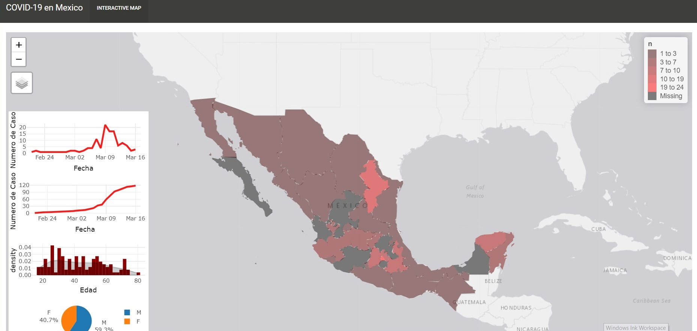

El comportamiento de muchas enfermedades infecciosas puede ser predicho usando simples ecuaciones diferenciales. En este post explicare, de manera introductoria, como podemos utilizar informacion para ajustar un modelo matematico y hacer algunas predicciones.  

Aprovechando la atencion que esta teniendo el coronavirus, usare los datos officiales reportados por secretaria de salud para crear un modelo en el cual podamos obtener informacion como la tasa de transmission y el tamaño esperado de la epidemia.  

Si observamos la siguiente grafica, del lado izquierdo veremos el numero cumulativo de casos infectados por COVID-19 empezando desde el dia 02 de febrero del 2020, cuando se reporto el primer caso en Mexico. podemos observar como existe un crecimiento exponencial en el numero de infectados. Si hacemos una transformacion logaritmica a este numero de casos, veremos que hay una buena relacion lineal entre el dia y el numero de casos. Idealmente nos gustaria ver que todos los puntos siguieran la linea recta y asi podriamos predecir con mejor certeza como se comportara la enfermedad.  


```{r include=F}
# Librerias que usamos
library(dplyr); library(deSolve)
#Opciones para correr el documento (No es necesario correr esta linea)
knitr::opts_chunk$set(warning = F, message = F, echo = F)
```


```{r}
#### Obtener los datos de la epidemia, se tiene que tener instalado el paquete devtools y nCovid2019

# install.packages("devtools")
# devtools::install_github("GuangchuangYu/nCov2019")

COVID <- nCov2019::load_nCov2019(source = "github", lang = "en")
COVID <- COVID['global']
# Obtener el numero de infectados para Mexico
Infected <- COVID %>%
  filter(country == "Mexico") %>%
  pull(cum_confirm)

# Poblacion actual de Mexico
N <- 1289327530

# Dias desde el comienzo
Day <- 1:(length(Infected))
```


```{r}
#####
##Obtener grafico de infectados totales y en escala logaritmica
par(mfrow = c(1, 2), bty = 'n')
plot(Day, Infected, type ="b", pch = 16, col = "red3", xlab = "Dia", ylab = "Infectados", bty = "n")
plot(Day, Infected, log = "y", pch = 16, col = "red3", xlab = "Dia", ylab = "log(Infectados)", bty = 'n')
abline(lm(log10(Infected) ~ Day), col = "grey20")
title("Infecciones totales por  COVID-19 en Mexico", outer = TRUE, line = -1)
```
  
  
Para que nuestro modelo tenga buena convergencia, los puntos del graficod e la derecha deben de seguir la linea recta, esto quiere decir que existe una relacion exponencial en el numero de casos y la longitud de la epidemia. En nuestro ejemplo podemos ver que existe cierto patron lineal, pero no del todo.    

Usando estas relaciones, podemos usar un modelo que es muy conocido en epidemiologia por su simplicidad. El tipo de modelo que usaremos se llama SIR (Susceptibles $\rightarrow$ Infectados$\rightarrow$ Recuperados), en el cual dividimos nuestra poblacion en compartimentos y asumimos que existe una tasa de contactos e infectividad que puede representar bien a nuestra poblacion.  

$$\frac{dS}{dt}=-\frac{\beta IS}{N} \\
 \frac{dI}{dt} = \frac{\beta IS}{N} - \gamma I \\
 \frac{dR}{dt} = \gamma I$$  
 
Las ecuaciones anteriores simplemente describen la tasa en la que los individuos pasan de un compartimento a otro. En donde $S$ representa el compartimento de la poblacion susceptible, $I$ los infectados y $R$ recuperados. En las ecuaciones diferenciales definimos un intervalo de tiempo y la ecuacion se resolvera a ese intervalo. $\frac{dS}{dt}$ representa el cambio en el numero de susceptibles en cada paso de nuestro modelo en el que se mueven del compartimento $S \rightarrow I$ con  $\frac{\beta IS}{N}$ numero de individuos y del compartimento $I\rightarrow R$ con $\gamma I$ numero de individuos.  

Uno de los retos mas grandes de este modelo es escoger los parametros de $\beta$ y $\gamma$ que representan la tasa en la que se transmite la enfermedad a la poblacion y la tasa en la que se recupera.  
Usando los datos de el numero de casos, podemos usar optimizadores, como por ejemplo uno que minimize la suma de los cuadrados (Ecuacion a continuacion), para encontrar los parametros de $\beta$ y $\gamma$ para nuestro modelo que tengan un comportamiento mas parecido a los datos observados.

$$RSS(\beta, \gamma) = \sum_t\left(I(t)-\hat{I}(t)\right)^2$$
En donde $I(t)$ es el numero de casos observados y $\hat{I}(t)$ es el numero de casso que nuestro modelo predice.  
Una vez que encontremos esos valores para nuestros parametros $\beta$ y $\gamma$, podemos usarlos en un modelo de simulacion y realizar predicciones sobre la epidemia.  

```{r}
################################### 
## Funciones que usaremos
# Funcion para las ecuaciones diferenciales
SIR <- function(time, state, parameters) {
  par <- as.list(c(state, parameters))
  with(par, {
    dS <- -beta/N * I * S
    dI <- beta/N * I * S - gamma * I
    dR <- gamma * I
    list(c(dS, dI, dR))
    })
}
## FUnction para la optimizacion del modelo
RSS <- function(parameters) {
  names(parameters) <- c("beta", "gamma")
  out <- ode(y = init, times = Day, func = SIR, parms = parameters)
  fit <- out[ , 3]
  sum((Infected - fit)^2)
}
# Funcion para determinar si existe buena convergencia del modelo
CNV <- function(x){
  if(x == "CONVERGENCE: REL_REDUCTION_OF_F <= FACTR*EPSMCH"){
    return("Buena Convergencia del Modelo")
  } else{
    return("Modelo fallo a converger")
  }
}
###################################
# Condiciones iniciales del modelo
init <- c(S = N-Infected[1], 
          I = Infected[1], 
          R = 0)
# Optimizacion del modelo
Opt <- optim(c(0.5, 0.5), RSS, method = "L-BFGS-B", lower = c(0, 0), upper = c(1, 1))
# Nombrar los parametros obtenidos en la optimizacion
Opt_par <- setNames(Opt$par, c("beta", "gamma"))
```
Usando los datos proporcionados por secretaria de salud logramos una **`r CNV(Opt$message)`**, y los parametros estimados son: $\beta=$ `r Opt$par[1]`, $\gamma=$ `r Opt$par[2]` resultando en un $R_0$ de `r Opt$par[1]/Opt$par[2]`. $R_0$ es un valor utilizado frequentemente para describir el impacto de una enfermedad en la poblacion. Un $R_0 > 1$ significa que la enfermedad causara una epidemia en la poblacion y un $R_0 < 0$ significa que no habra epidemia.     
  
  
A continuacion usamos esos parametros estimados para nuestras ecuaciones por un periodo de 150 dias.  
En el grafico del lado derecho vemos el la poblacion para cada uno de nuestros compartimentos a traves del periodo de tiempo que simulamos, y del lado derecho vemos el logaritmos de los valores de cada compartimento, Los asteriscos rojos en el grafico del lado derecho representan los casos reales reportados por secretaria de salud, esto nos ayuda a visualizar que tan bien nuestro modelo se ajusta a los datos reales.  

```{r fig.height=6, fig.width=14}
#### Graficos del resultado del modelo
t <- 1:180 # time in days
# Correr el modelo con los parametros obtenidos
fit <- data.frame(ode(y = init, times = t, func = SIR, parms = Opt_par))
# Crear paleta de colores
col <- c("darkgreen", "darkred", "darkblue")
## Graficar los datos
par(mfrow = c(1, 2), bty = 'n')
plot(I~time, data = fit, type = "l", xlab = "Dia", ylab = "Poblacion", lwd = 2, lty = 1, col = "darkred")
plot(I~time, data = fit, type = "l", xlab = "Dia", ylab = "Poblacion", lwd = 2, lty = 1, col = "darkred", log = "y")
points(Day, Infected, pch = 8, col = "red", cex = 1.5)

legend("topright", c("Susceptibles", "Infectados", "Recuperados"), lty = 1, lwd = 2, col = col)
title("Modelo de ecuaciones diferenciales para COVID-19 en Mexico", outer = TRUE, line = -1)
df <- fit[fit$I == max(fit$I), "I", drop = FALSE] # height of pandemic
```


Finalmente podemos obtener una extrapolacion de la epidemia. De acuerdo a la extrapolacion, el dia esperado del pico de la epidemia es el dia **`r rownames(df)`** despues de haber empezado la epidemia con un estimado de `r df$I` infectados, lo cual puede que sea no muy realista por algunos aspectos que comentaremos a continuacion.    

### Consideraciones para este tipo de modelos.

Este tipo de modelos asume que existe una probabilidad de contactar con un infectado para toda la poblacion, lo cual no es algo cierto en muchos casos. La transmision de enfermedades a nivel individual, frequentemente se ve influida por la red de contactos de cada persona y sabemos que la estructura de esa red de contactos depende de caracteristicas individuales de cada persona, tales como su profesion o ubicacion geografica, algo que en este modelo no estamos representando.  
Otro aspecto importante que no consideramos en este modelo es la reaccion de la gente ante la epidemia. Sabemos que esto puede disminuir notoriamente el numero de casos y la duracion de la epidemia. He ahi la importancia de la reduccion de contactos entre las personas.  


Si deseas ver mas sobre la distribucion espacial de la epidemia, puedes ver el mapa que he hecho siguiendo este [LINK](https://jpablo91.shinyapps.io/COVID19_Mx/)  



<!-- <a href="https://jpablo91.shinyapps.io/COVID19_Mx/" title="LINK">LINK</a> -->

# Apendice
```{r ref.label=knitr::all_labels(),echo=TRUE,eval=FALSE}

```
