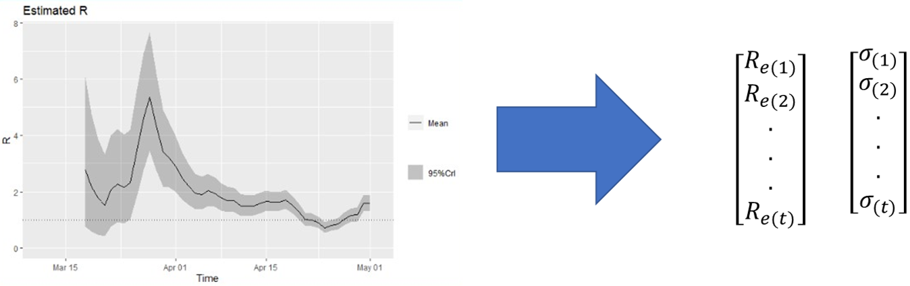
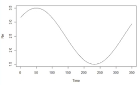

Our model is an adaptation of another model developed by the research group of Richard Neher from the university of Basel.     

The model consists on a compartmental extended SIR model, where the population is break down in multiple compartments stratified by age group and condition (having Smoking, diabetes or hearth disease vs none). The population of the county ($N$) is distributed between the estimations for each of the stratification groups ($N_i$), the proportion of the population for each group was estimated using the CHIS census.  

```{r out.width = '50%', fig.show='hold', echo=F, fig.align='center'}
knitr::include_graphics(rep('Images/COVIDModel/StratTable.png'))
```
  
  
The flow of the population among the compartments goes as follows:  

```{r out.width = '50%', fig.show='hold', echo=F, fig.align='center'}
knitr::include_graphics(rep('Images/COVIDModel/Model.png'))
```

Where the subscript $i$ indicates each of the stratification groups, and the compartments represent:  

 - Susceptible ($S$), population that is susceptible for the infection (in this model we assume that everyone in the county are susceptible, N = 550,000).
 - Exposed ($E$). The transition from exposed to infectious is divided into 3 stages (E1, E2, E3).
 - Infected ($I$). The infectious segment of the populations.
 - Hospitalized ($H$). The sick individuals that had to be hospitalized.
 - Intensive Care Unit ($C$). The individuals that had to be at intensive care unit. 
 - Death ($D$). The individuals that died from the disease.   
  
The change between compartments is given by the following equations:  

$$ \begin{split}
\frac{dS_i}{dt} &=  - \frac{\beta_i(t)S_iI}{N} + \frac{m_i}{N_i} \  \text{(Change in Susceptible)} \\ 
\frac{dE1_i}{dt} &= \frac{\beta_i(t)S_iI}{N} - t_{l}^{-1}3E1_i \  \text{(Change in Exposed 1)}\\
\frac{dE2_i}{dt} &= t_{l}^{-1}3E1_i - t_{l}^{-1}3E2_i \  \text{(Change in Exposed 2)} \\
\frac{dE3_i}{dt} &= t_{l}^{-1}3E2_i - t_{l}^{-1}3E3_i \  \text{(Change in Exposed 3)} \\
\frac{dI_i}{dt} &= t_{l}^{-1}3E1_i - t_I^{-1}\delta_iI_i  - t_I^{-1}\gamma_iI \  \text{(Change in Infected)}\\
\frac{dH_i}{dt} &= t_I^{-1}\delta_iI_i + t_{c}^{-1}\bar{\omega_i}H - t_{h}^{-1}\zeta_iH - t_{h}^{-1}\bar{\zeta_i}H\  \text{(Change in Hospitalized)} \\
\frac{dC_i}{dt} &= t_{h}^{-1}\zeta_iH - t_{c}^{-1}\omega_iH -  t_{c}^{-1}\bar{\omega_i}H \  \text{(Change in ICU)} \\
\frac{dR_i}{dt} &= \gamma_iI + t_{h}^{-1}\bar{\zeta_i}H \  \text{(Change in Deaths)}
\end{split}
$$

Parameters (indicated with the $i$ subscript) were calculated for each of the stratification groups based on the observed hospitalization rates by age and condition reported by the CDC (https://www.cdc.gov/mmwr/volumes/69/wr/pdfs/mm6915e3-H.pdf) . Parameters $t^{-1}$, represent the inverse of the average number of days the individuals spend on each of the compartments ($t_l$ = latency period, $t_I$ = infectious period, $t_h$ = days at the hospital, $t_c$ = days at ICU). Detailed information of the parameters can be found on the following table.  

* All the parameters were estimated based on National statistics, it is important to note that the disease dynamic might have a different behavior in the county 

| Symbol     | Name of parameter                      |
| :--------- | :------------------------------------- |
| $m_i$      | Imports per day                        |
| $\delta_i$ | Probability of Hospitalization         |
| $\gamma_i$ | Probability of Recovery from Infection |
| $\zeta_i$  | Probability of moving to ICU           |
| $\omega$   | Probability of dying                   |


# Estimation of $\beta_i$

The $\beta_i$ parameter is a time dependent estimation based on the $R_e$, the effect of interventions and the seasonality.  

### Effective reproduction number ($R_e$)

The effective reproduction number is calculated using the package `EpiEstim`, then we use an average of the calculated $R_e$ of the previous 7 days to obtain the $R_e$ at each simulation step.  
The stochastic version of the model uses the $\sigma$ estimated to include incertainty on the $R_e$ estimation for each iteration.  

```{r out.width = '70%', fig.show='hold', echo=F, fig.align='center'}

```

### Interventions
The interventions can be applied to a time frame with an effect that is assumed to be constant over the time the intervention was applied.  
The transmission parameter ($\beta_I$) is scaed by the effect ($\phi$)of intervention as follows:
$\beta_i(t) = R_e\phi M(t)$

### Seasonal effect.  
The seasonal variation is based on a function where the seasonal peak is modeled based on a sinusoidal function with an annual period. The model allows to specify the seasonal peak and the force of the seasonality.  

$\beta_i(t) = R_e(1+\epsilon \cos(2\pi(t-t_{peak})))/365$  


```{r out.width = '20%', fig.show='hold', echo=F, fig.align='center'}

```
  
  
  
### [Go back to the app](https://jpablo91.shinyapps.io/StanTest/)


