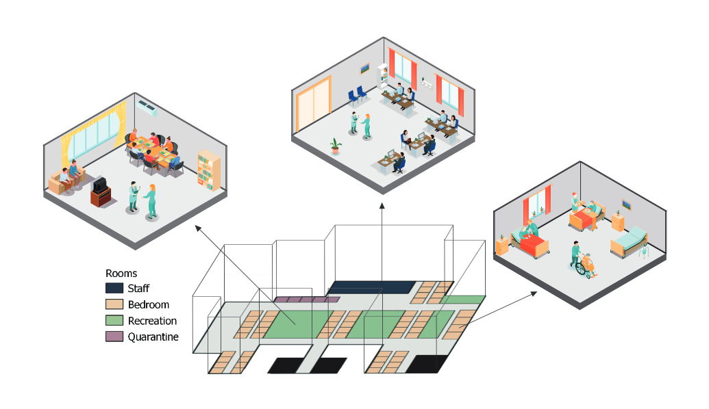
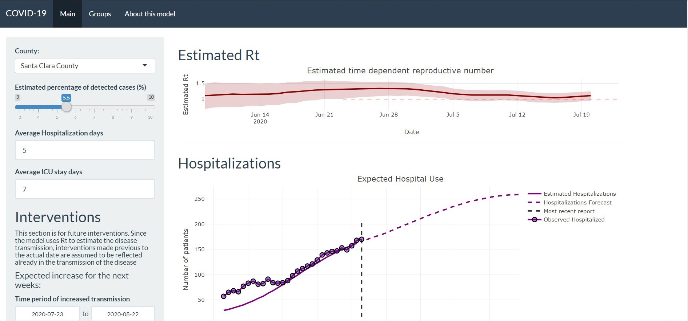

<h3>Hi I'm Pablo. I have always been fascinated by the application of mathematics to solve problems, I study Diseases in populations and in my free time I enjoy applying concepts of music, math and programming to create [music](https://linktr.ee/synthesaurio).</h3>

  
  
  
  

________________________

## Research Interest

I find exciting the applications of spatio-temporal statistics and network theory to study the dynamic of diseases in populations and the impact of anthropogenic activities in human, animal and environmental health.  

________________________

## Current projects.

As part of my work in my PhD I'm currently part of the [Center for Animal Disease Modeling and Surveillance at UC Davis](https://cadms.vetmed.ucdavis.edu/)  

### Testing and Vaccination to reduce the impact of COVID 19 in nursery homes.  
Residents of long-term care facilities have experienced a disproportionate burden of the COVID-19 pandemic. In this project we use Agent based modeling to explore the interventions such as testing and vaccination in reducing the impact of COVID-19 outbreaks in nursery homes. 

### Foot and mouth disease modeling in Ecuador.  
Foot and mouth disease(FMD) is a viral disease that affects cloven hoofed animals such as cows, pigs, sheep, among other domestic and wildlife ruminants. The importance of the disease is in the economic impact for affected countries. There has been great advances towards the eradication of the disease in South America in the last couple of years. Ecuador is in the last phase of eradication and the veterinary services is working hard on the eradication program. In this project in collaboration with AGROCALIDAD and PANAFTOSA, we apply tools from network theory and geostatistics to to develop tools that inform decision making.  
  

________________________

## Other Side Quests.

### Consulting 
Since 2018, I also collaborate as consultant for the Veterinary Center for Clinical Trials of the Veterinary Teaching Hospital of UC Davis. As part of my work there I assist on study design, sample size estimation and data analysis. You can [book me](https://www.picktime.com/6b6b1cbf-8f49-47a6-9a39-65573880dd13) trough my department website 

### Following the COIVD-19 epidemic.  
During the last couple of months I've participated in different activities related with the COVID pandemic. 
You can find some posts from the early epidemic in Mexico [Here](https://jpablo91.github.io/COVIDMx/).  
I am also part of a collaborative project funded by [Alianza UCMX](https://alianzaucmx.ucr.edu) where we are looking at the vulnerable areas in Mexico city.  

  

________________________

## Previous projects

### Classical Swine Fever in Peru.
Classical Swine Fever is a viral disease that affects the swine industry. In Peru, the disease is endemic and there is a current vaccination program. We applied methodologies from network theory and regression analysis to investigate the asociation of the incidence of the disaese with socio economic factors and the networ structure, and evaluate the vaccination program.  
  

