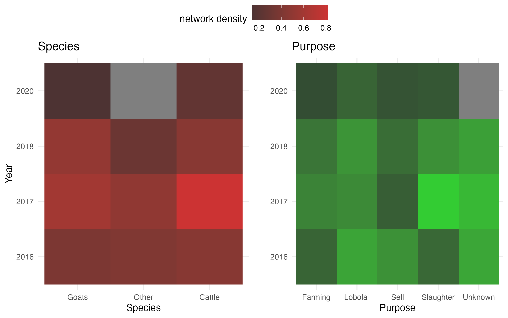
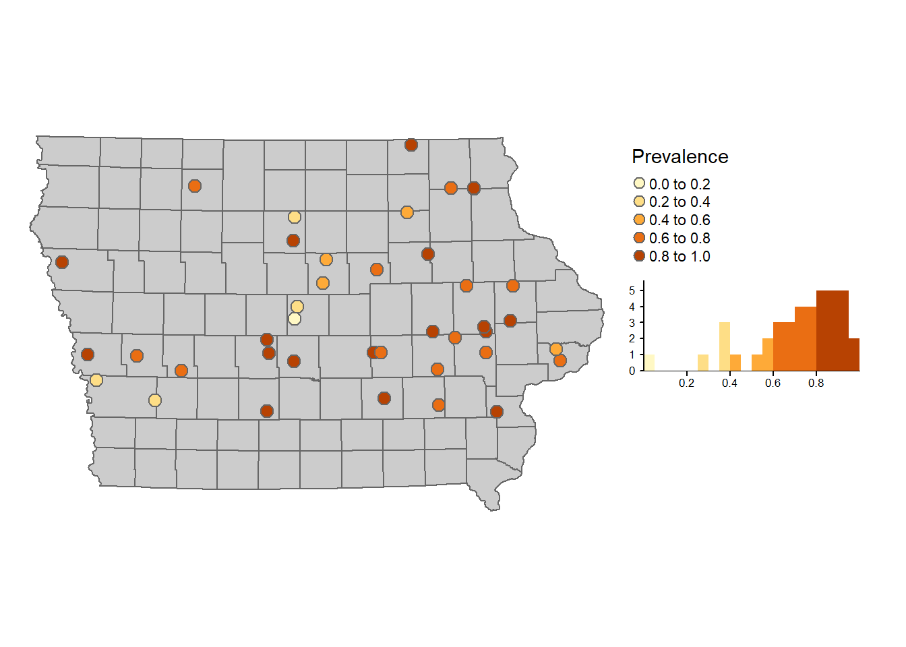
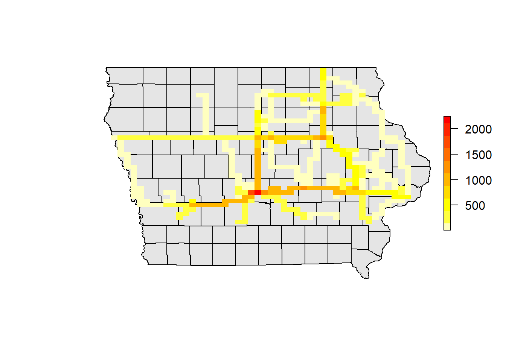
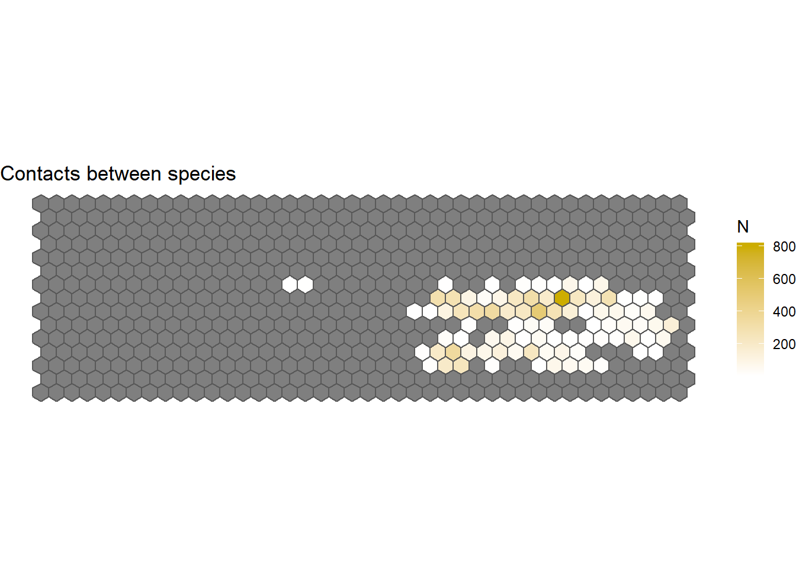
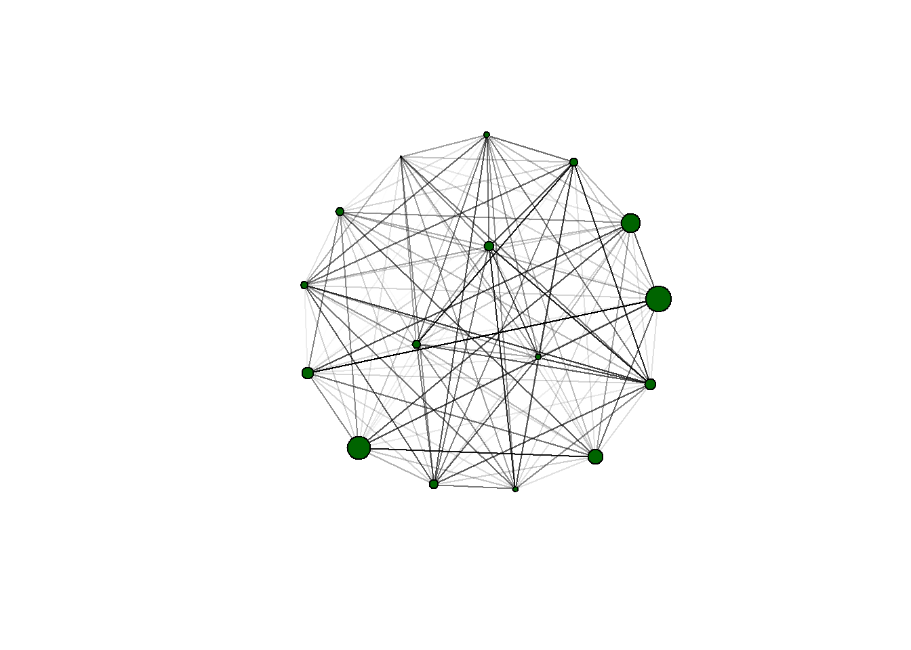

One of my interests is in building bridges with different institutions that can promote future collaborations. I'm interested in exchanging ideas and knowledge with others. With contributions of different collaborators, I have created a couple of workshops that I have been offering since 2019. Some of these workshop has been offered multiple times in both Spanish and English, having a wide variety of participants including academics, government and industry from different countries. Workshops are available both remote and in person formats.  

Other topics for workshops might be available upon request.  

  

  
  
  
________________________

## Getting started with R for epidemiology research

This is an introduction to R studio and how to integrate it for research with emphasis in epidemiology. Some of the topics covered include:
  
  - Project organization and version control
  - R programming
  - Data processing
  - Data visualization

[More information](https://cadms-ucd.github.io/PROCINORTE_TT/index.html)  

________________________

## R for statistical analysis

This workshop introduces on how to use R for statistical analysis. Some of the topics covered include:

  - Hypothesis testing 
  - Which statistical method should I use?
  - Regression analysis
  - Data visualization
  - Generation of reports
  

________________________

## Developing interactive dashboards for data analysis and visualization

This workshop covers the basics on using shiny to develop interactive dashboards. The dashboards can be used for data visualization, analysis or collection of information. Some of the topics covered includes: 
  
  - Introduction to R shiny
  - Generate static and interactive visualizations
  - Strategies to make your dashboard more efficient
  - Uploading your dashboard to a server so it can be shared and distributed.

________________________

## Geostatistical tools for Epidemiology

The aim of this workshop is to provide an overview of different tools to manipulate and analyse spatial data. Some of the topics covered include:  

  - Manipulation of databases.
  - Statistical Inference.
  - Manipulation of Spatial data.
  - Spatial Autocorrelation
  - Geostatistical tools for inference.

More information [English](WS1.html) | [Spanish](WS1Spa.html)

________________________

## Spatio-Temporal Analysis of Contact networks

This workshop covers the integration of Network Theory and spatio-Temporal tools for descriptive analysis and some inference of contact networks. Some of the topics covered in this workshop includes:

  - Static and dynamic network analysis.
  - Visualization of spatio-temporal networks.
  - Network Based models and applications. 
  

More information [English](WS2.html) | [Spanish](WS2Spa.html)

________________________

  
More information is available upon request contacting: jpgo@ucdavis.edu