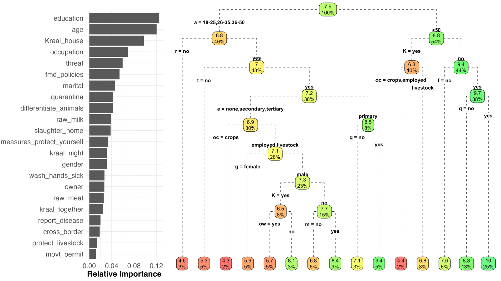
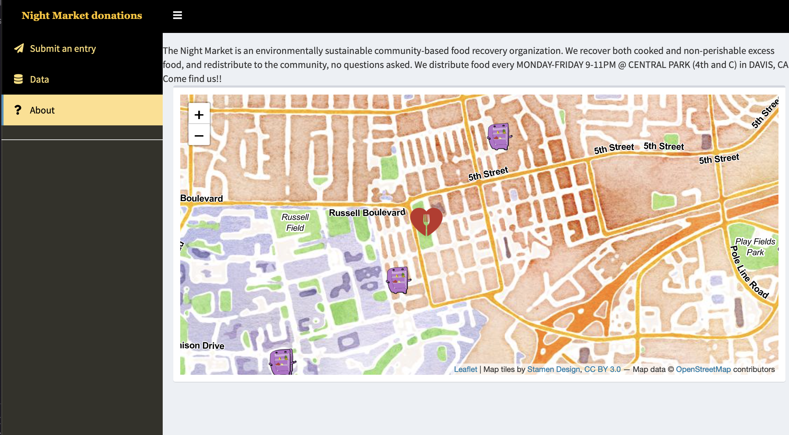
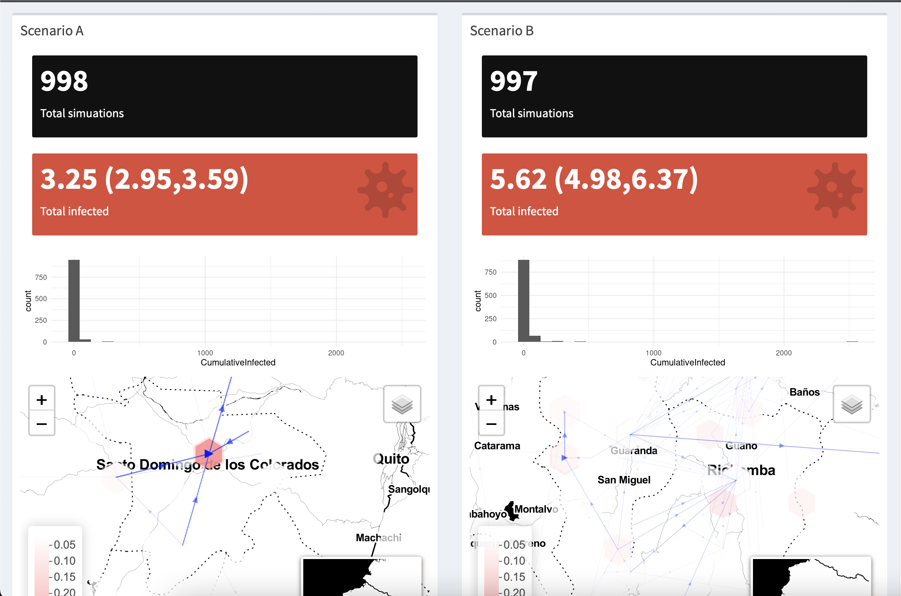
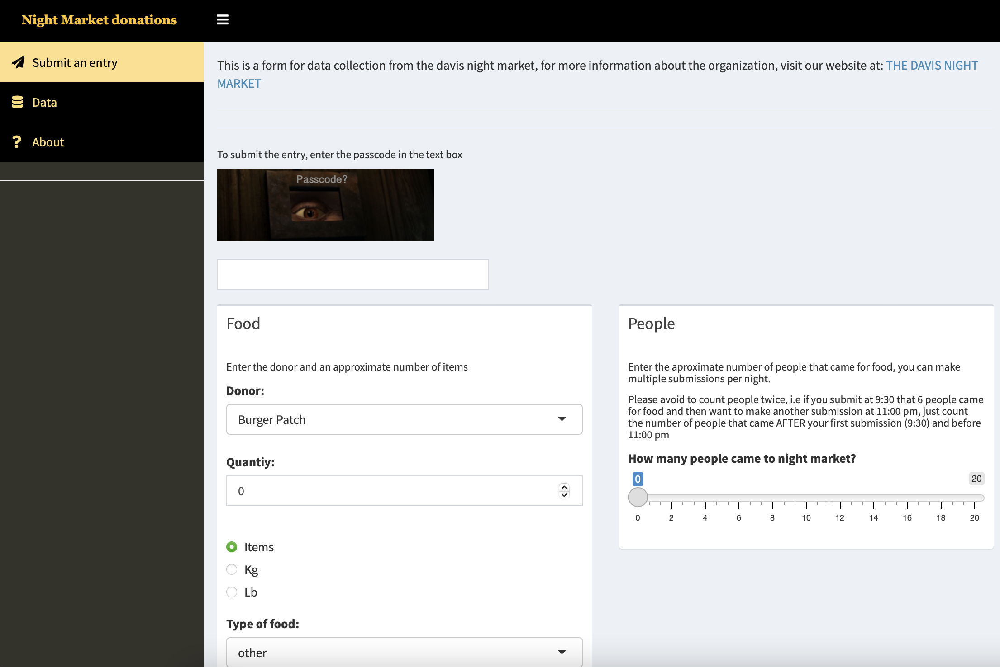
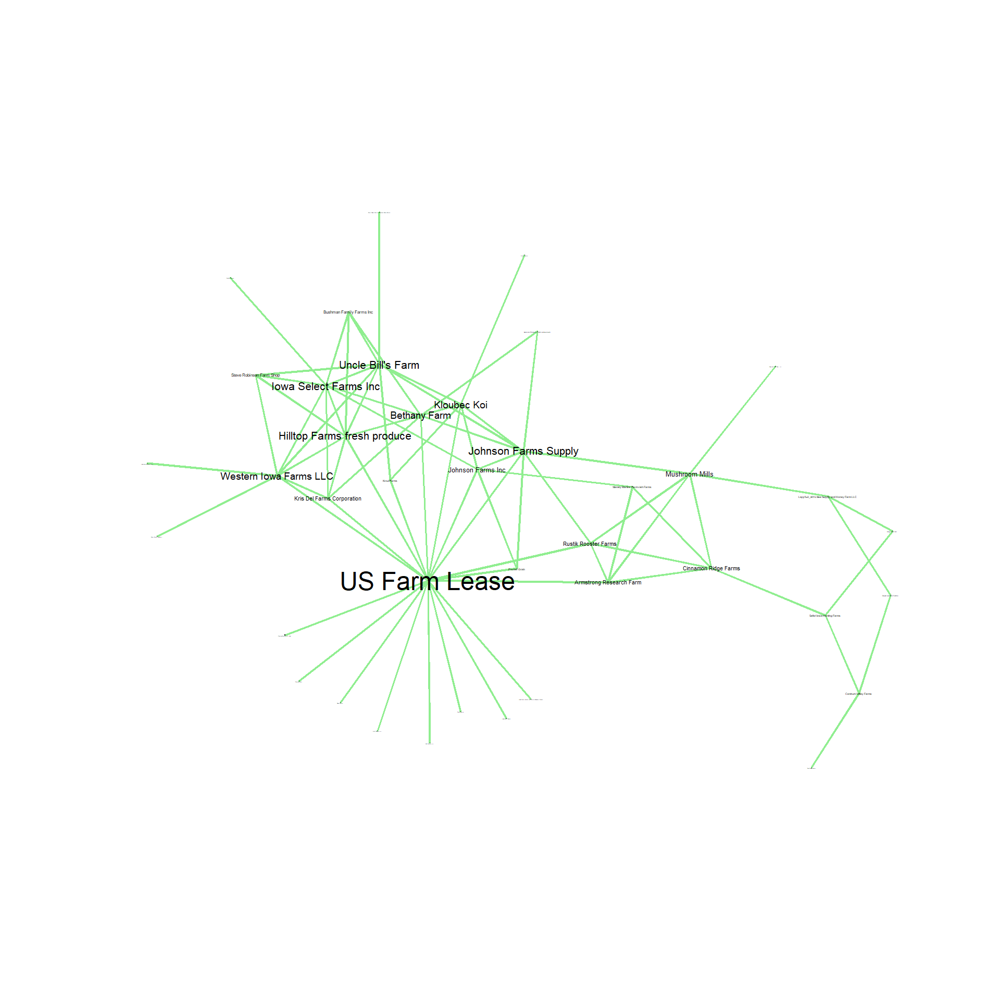

I believe that facilitating information in succinct and clear ways in the form of courses, mentoring, and developing teaching materials is as important as my research itself to expand the impact and reach of my work. I have developed extensive teaching materials in diverse topics, both in Spanish and English, at introductory and advanced level. I recognize that all my teaching activities are not only beneficial to the students I interact with, but are highly valuable to me as well. I have learn so much from previous students and continuously improve my materials upon the experiences from the diverse audiences is presented to.
Previous workshops have been developed and adapted to doverse audience having a wide variety of participants including academics, government and industry from different countries. Workshops are available both remote and in person formats.  

Other topics for workshops might be available upon request.  

  

  
  
  
________________________

## Getting started with R for epidemiology research

This is an introduction to R studio and how to integrate it for research with emphasis in epidemiology. Some of the topics covered include:
  
  - Project organization and version control
  - R programming
  - Data processing
  - Data visualization

[More information](https://cadms-ucd.github.io/PROCINORTE_TT/index.html)  

________________________

## R for statistical analysis

This workshop introduces on how to use R for statistical analysis. Some of the topics covered include:

  - Hypothesis testing 
  - Which statistical method should I use?
  - Regression analysis
  - Data visualization
  - Generation of reports
  

________________________

## Developing interactive dashboards for data analysis and visualization

This workshop covers the basics on using shiny to develop interactive dashboards. The dashboards can be used for data visualization, analysis or collection of information. Some of the topics covered includes: 
  
  - Introduction to R shiny
  - Generate static and interactive visualizations
  - Strategies to make your dashboard more efficient
  - Uploading your dashboard to a server so it can be shared and distributed.

[Workshop materials](https://www.spablo-temporal.network/ShinyWorkshop/)
________________________

## Geostatistical tools for Epidemiology

The aim of this workshop is to provide an overview of different tools to manipulate and analyse spatial data. Some of the topics covered include:  

  - Manipulation of databases.
  - Statistical Inference.
  - Manipulation of Spatial data.
  - Spatial Autocorrelation
  - Geostatistical tools for inference.

More information [English](WS1.html) | [Spanish](WS1Spa.html)

________________________

## Spatio-Temporal Analysis of Contact networks

This workshop covers the integration of Network Theory and spatio-Temporal tools for descriptive analysis and some inference of contact networks. Some of the topics covered in this workshop includes:

  - Static and dynamic network analysis.
  - Visualization of spatio-temporal networks.
  - Network Based models and applications. 
  

More information [English](WS2.html) | [Spanish](WS2Spa.html)

________________________

## Risk assessment with quantrra

Risk assessment (RA) has been proven to be a valuable tool for supporting decision-making. In the context of transboundary animal diseases, RA is critical for any disease control program to evaluate the risk of a potential introduction and identify areas where reinforced surveillance can have higher impact on reducing the risk. Although there are several tools available for RA, many of these tools are not very accessible and can be time consuming to implement. In this workshop we will cover basics of RA using open access tools. We will use examples in animal health epidemiology.
Learning objectives: This workshop will cover the how to develop risk assessment and its implementation with R and the quantrra library.
Expected outcomes: Participants will have a basic understanding on how to develop and implement risk assessment using R, and how to interpret the results of the analysis.

[Materials](http://spablo-temporal.network/ra-workshop/)

________________________
  
More information is available upon request contacting: jpgo@ucdavis.edu